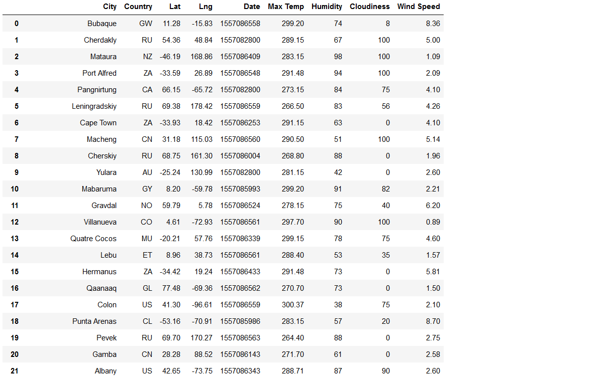
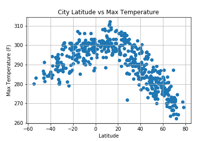
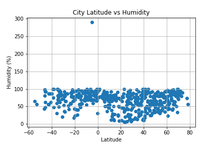
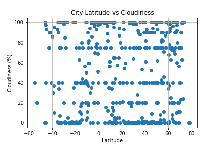
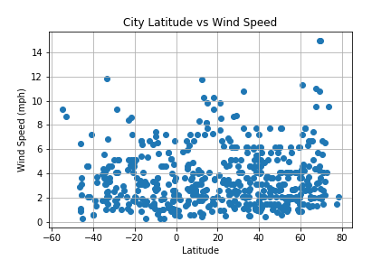

# Analyzing Data Using Python APIs

Here we analyze weather data in relationship to the latitude and longitude. We have a list of latitudes, longitudes and the closest cities to these coordinates. Using this information, we will get the maximum temperature, cloudiness, humidity and wind speed.

First, the latitudes and longitudes are randomly generated using the numpy's random number generator. Then using the citipy library, the nearest city to that latitude and longitude are found.

Then we find the weather of each city using the Open Weather API. Then we will show each API call using the city list. If the city is included in the API, we show it is being processed. If the city or location is not included in the API, the we acknowledge that the city is not found.

Then we convert the obtained data to a Data Frame which we can use to create scatter plots that show the weather patterns as we move closer to the equator. The scatter plots that are generated are:
* Latitude v Max Temperature
* Latitude v Humidity
* Latitude v Cloudiness
* Latitude v Wind Speed

Lastly, the results will be exported to a CSV file.

## Findings & Results

### List of API Calls

### City Data

### Latitude v Max Temperature

### Latitude v Humidity

### Latitude v Cloudiness

### Latitude v Wind Speed

## Conclusion
The scatter plots generated show that some weather components show a positive relationship as a city gets closer to the equator whereas some scatter plots show that there is little relationship as latitudes get closer to the equator.

As the cities get closer to the equator the, the max temperature is getting hotter. However, the humidity, cloudiness and wind speed show a very week relationship to the latitude.